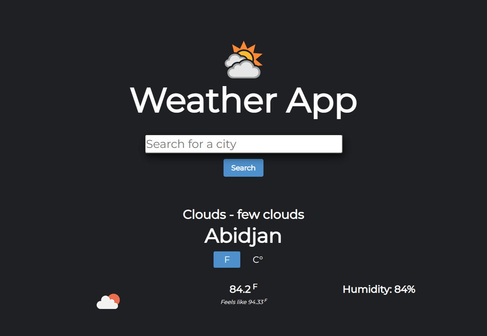

# weather-app
The goal of this project is to build a weather app with webpack, ES6 modules, and API.

- I wrote the functions that hit the API. Functions that can take a location and return the weather data for that location.
- Set up a simple form that will let users input their location and fetch the weather info
- Styled the page using bootstrap 4

## Project screenshot

## 🔨 Built with

- JavaScript
- Webpack
- Bootstrap 4
- Open Weather API: https://openweathermap.org/api

## 🚀 Our Project

Our project can be found at https://github.com/daviidy/weather-app

## Live Demo

You can find the demo [here](https://daviidy.github.io/weather-app/)

## To run the project in local

- make sure you have have NodeJS and NPM installed in your computer
- clone the repository from here [repo link](https://github.com/daviidy/weather-app)
- navigate in your terminal to the folder `weather-app`
- run `npm install`
- run `npx webpack`
- open index.html with your browser

## 👨🏽‍💻 👨🏿‍💻 Creators

👤 **Author1**

- Github: [@daviidy](https://github.com/daviidy)
- Twitter: [@davidyao3](https://twitter.com/DavidYao3)
- LinkedIn: [@daviidy](https://www.linkedin.com/in/david-yao-6bb95299/)
- Personal Website: [@daviidy](http://david-yao.com/en/portfolio.html)

## 🤝 Contributing

Contributions, issues and feature requests are welcome!

## Show your support

Give a ⭐️ if you like this project!

## 📝 License

This project is no licensed.
Thank you to the Open Weather API: https://openweathermap.org/api
